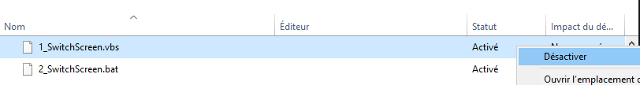

# Switch Screen for CSGO

This app will provide you a switch that allows **only your main screen** to work **during csgo's sessions** (to save fps) and that will **extends screens where you close the game**.

## Installation

To install this app you just need to **1_SwitchScreen.vbs**

This will copy the .exe to the startup program's folder, so that will work every time that you launch your game!

## Disable

To disable it you have to go to the Taskmanager (`ctrl + alt + del` then Taskmanager)

In the Startup tab, `right click` on 1_SwitchScreen.vbs and 2_SwitchScreen.bat and disable them

## Uninstall

To uninstall the app you have to **delete it from startup program's folder**

To do it press *windows + R* and write *shell:startup*

Then delete **1_SwitchScreen.vbs and 2_SwitchScreen.bat**

You can also **disable it** in the task Manager, startup tab
